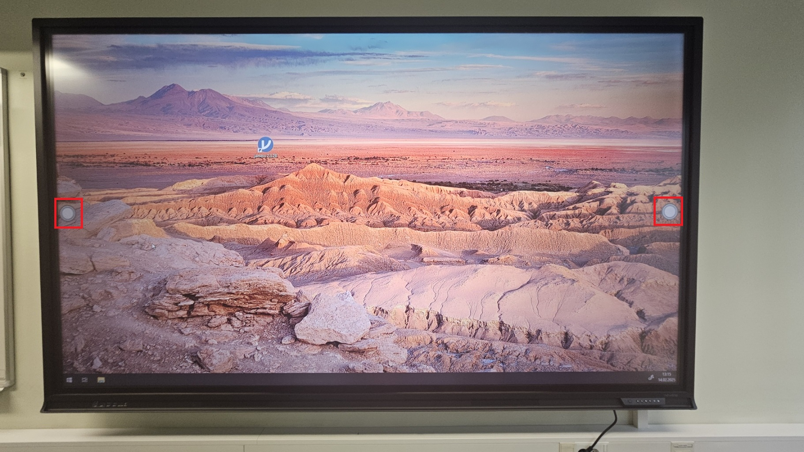

# Newline puutetundlikud ekraanid

DTI klassides:
* M217
* S303
* A303
* A406

## Märkmete tegemine kuvatava pildi peale
1. Ava ekraani küljel olev kiirmenüü

2. Vali märkmete tegemise rakendus

3. Nüüd oled märkmete tegemise režiimis - sinu tehtavad märkmed ei muuda kuidagi avatud faili sisu, need tehakse eraldi kihile, mida saad soovi korral salvestada. 

    Ekraani alaserva ilmus tööriistariba:
 
    1. **pliiats** - vaba käega kirjutamise vahend. Pikemal vajutamisel saad valida joone paksuse ja värvi.
    2. **marker** - saad paksema joonega teksti markeerida (markeering on läbipaistev). Pikemal vajutamisel saad valida markeeringu laiuse ja värvi.
    3. **valikutööriist** - saad juba tehtud märkmeid valida, liigutada ja muuta.
    4. **kustutamine** - saad juba tehtud märkmeid kustutada.
    5. **terve ekraani kustutamine** - kustutad ekraanilt kõik tehtud märkmed.
    6. **ekraanipildi salvestamine** - saad salvestada parajasti ekraanil oleva pildi koos märkmetega.
4. Märkmete tegemise režiimist väljumiseks vali külgmenüüst uuesti märkmete tegemise rakendus (märka, et ikooni juures on nüüd väike punane rist)

## Ekraanipildi ja märkmete salvestamine mälupulgale läbi Download rakenduse

1. Olles märkmete tegemise režiimis vali ekaanipildi salvestamise tööriist.

2. Avaneb ekraanipildi salvestamise tööriistariba

    1. **Ekraaniosa valimise tööriist** - vaikimisi salvestatakse terve ekraan
    2. **Valitud ekraaniosa saatmine tahvli rakendusele** - valitud ekraaniosa avatakse eraldi pildiosana valge tahvli rakenduses, kus saab teha lisamärkmeid ja muudatusi.
    3. **Valitud ekraaniosa salvestamine andmekandjale** - valitud ekraaniosa saab salvestada ekraani sisemisele andmekandjale või mälupulgale.
    4. **Ekraanipildi salvestamisest loobumine**

3. Kui valid **Valitud ekraaniosa salvestamine andmekandjale**, siis avaneb järgmine menüü

4. Ühenda oma USB salvestusseade ekraaniga ja vali **Download**. Avanenud rakenduses vali äsja tehtud ekraanipildi juures kontekstimenüü

5. Avanenud kontekstimenüüst vali **Copy to** - kontekstimenüüd võib olla vaja selle käsu leidmiseks allapoole kerida.  

6. Avanenud aknast vali oma USB seade ja sellelt sobiv kataloog. vajuta "Copy here"
7. Download rakendusest tagasi märkmete tegemise rakendusse saab vajutades Androidi tagasi nuppu

## Ekraanipildi ja märkmete salvestamine mälupulgale läbi Tahvli rakenduse

1. Olles märkmete tegemise režiimis vali ekaanipildi salvestamise tööriist.

2. Avaneb ekraanipildi salvestamise tööriistariba

    1. **Ekraaniosa valimise tööriist** - vaikimisi salvestatakse terve ekraan
    2. **Valitud ekraaniosa saatmine tahvli rakendusele** - valitud ekraaniosa avatakse eraldi pildiosana valge tahvli rakenduses, kus saab teha lisamärkmeid ja muudatusi.
    3. **Valitud ekraaniosa salvestamine andmekandjale** - valitud ekraaniosa saab salvestada ekraani sisemisele andmekandjale või mälupulgale.
    4. **Ekraanipildi salvestamisest loobumine**

3. Kui valid **Valitud ekraaniosa saatmine tahvli rakendusele**, siis avaneb tahvli rakendus, kus ekraanipilt on eraldi objektina. Enne salvestamist on mõistlik on muuta ekraanipildi suurus samaks tahvli suurusega.

4. Ühenda oma USB salvestusseade ekraaniga ja vali eksportimise ikoon. 

5. Avanenud aknast vali sobiv failivorming ja vajuta **Export**  

6. Avanenud aknas kuvatakse QR kood, mis sisaldab faili allalaadimislinki - näiteks saavad seda kasutada õpilased oma nutitelefonidega. Samas aknas on ka valik **Save to USB**

7. Nüüd vali oma USB seade. Pilt salvestatakse sellel kataloogi "Whiteboard"

    **NB!** "disk" on ekraani enda sisemine mäluseade. 
    
